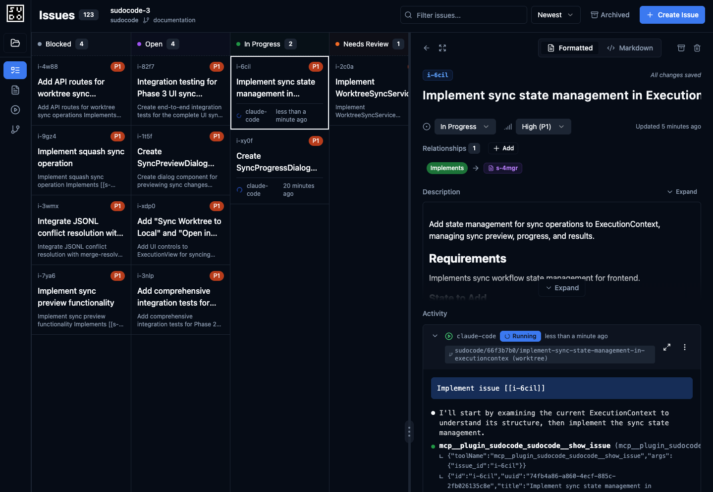
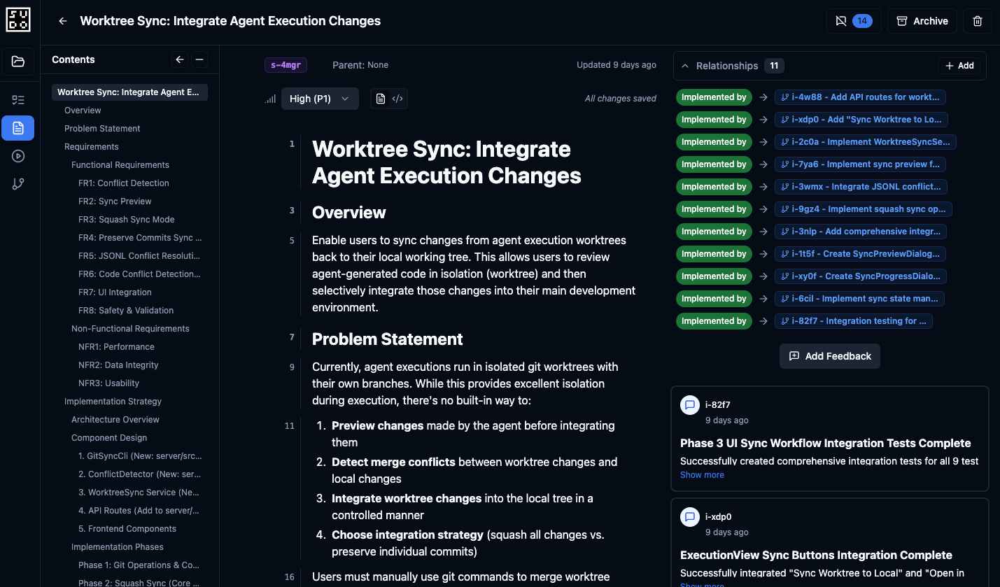
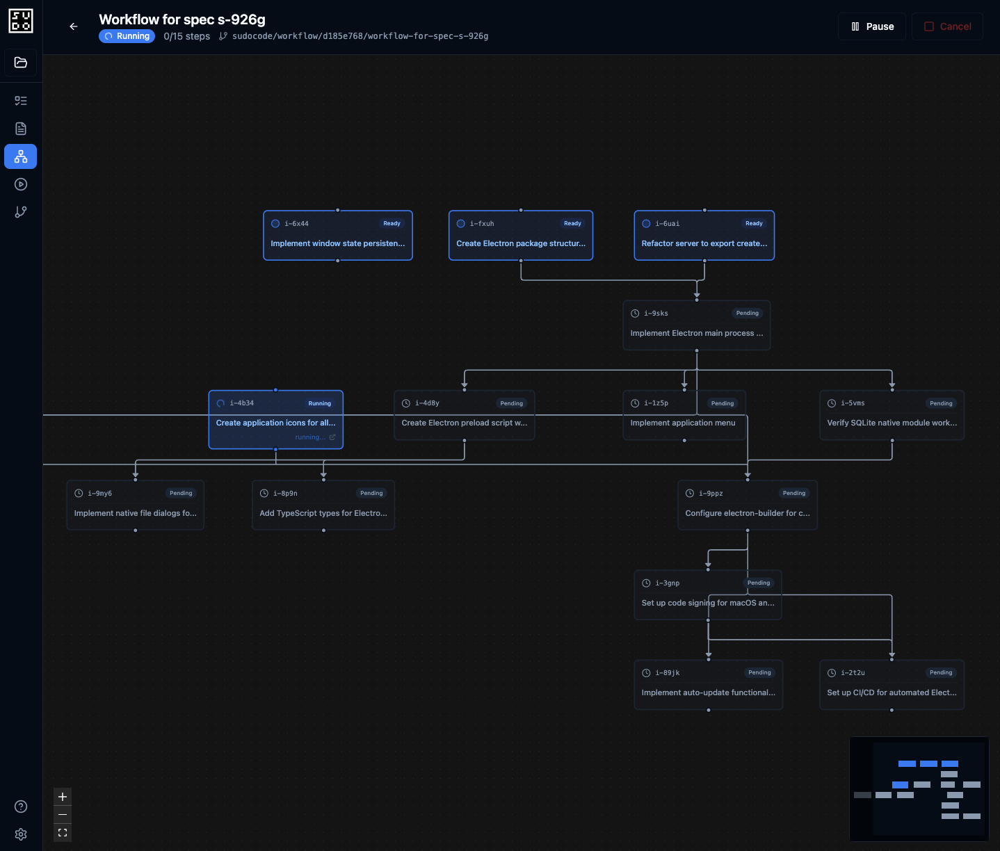
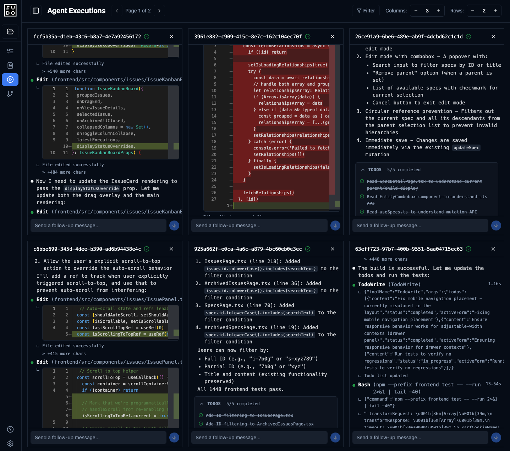

<div align="center">
    <picture>
        <source media="(prefers-color-scheme: dark)" srcset="media/banner-otto-dusk.gif">
        <source media="(prefers-color-scheme: light)" srcset="media/banner-otto-day.gif">
        
    </picture>
</div>

<h1 align="center">sudocode</h1>

<div align="center">
<a target="_blank" href="https://opensource.org/licenses/Apache-2.0" style="background:none">
    
</a><a target="_blank" href="https://www.npmjs.com/package/sudocode" style="background:none">
    
</a><a target="_blank" href="https://docs.sudocode.ai" style="background:none">
    
</a><a target="_blank" href="https://discord.gg/5t8GUW65EW" style="background:none">
    
</a>
</div>
<br/>
<p align="center">
  <code>npm install -g sudocode</code>
</p>

<p align="center">
<b>Automate the logistics of managing context and agents. Direct the work instead of babysitting agents.</b></p>

sudocode is a lightweight agent orchestration system that lives in your repo. Adding sudocode into your repo adds instant organizational capabilities to your coding agents. They'll gain the ability to track context over long-horizon tasks and work collaboratively on complex tasks.

### Key capabilities

- Automate context handoff for complex tasks with sudocode's git-native agent memory system
- Bring order to chaos by organizing your requirements, background context, and implementation plans into structured, executable issue graphs
- Visualize outputs and execution feedback in real-time
- Run as many Claude Code/Codex/Cursor (+more) agents in parallel as you can handle
- Isolate agent work in worktrees and creates checkpoints

### How it works

sudocode tracks human-specified requirements and objectives (what to do) as specs, and agent runtime context and plans (how to implement) as issues. These are trackable in git as a form of verson-controlled memory for your agents. Specs/issues are both human and agent-editable. This allows agents to manage their own context and leave contextual breadcrumbs as they run for all agents to reference.

Specs and issues form the backbone for advanced agent coordination and automation. Use specs to define high-level requirements and let agents carry out the implementation and manage their own issues.

### How to use it

The sudocode package includes a CLI, local server/UI, and an MCP server.

Use the CLI for managing specs and issues in sudocode's agent memory system. It contains a complete interface for viewing, editing, and managing relationships between entities.

Use the local server to automatically sync memory and enable agent execution and visualization. The issue kanban view helps you track issue status and progress. You can spawn new agents, update agent implementation plans, and provide feedback or guidance to running agents in a single, focused view.

<div style="margin: 2em 0;">
  
</div>

The spec editor view boosts spec-driven development to new heights. Edit and review specs with a full-featured block or markdown editor. Agents leave feedback on specs as they execute, so you can track their work and stay in the know for with the code they produce.

<div style="margin: 2em 0;">
  
</div>

Once you have a dependency graph of issues, you can also automate the implementation of each issue in the graph as a workflow. This runs each issue in topological order and accumulates changes in a temp branch/worktree. As it's executing, each issue will have its own commit, so you can revert backwards in the commit history if you want to continue developing from a specific point.

<div style="margin: 2em 0;">
  
</div>

If you're up for it, you can even monitor all running agent trajectories at the same time.

<div style="margin: 2em 0;">
  
</div>

**sudocode** provides a structured yet flexible system for organizing the chaos of human-AI collaboration in software development.

## Quick Start

```bash
# Install globally (recommended: use npx instead to avoid Node version conflicts)
npm install -g sudocode

# Initialize a sudocode project in your project directory.
sudocode init

# Run the local sudocode server from anywhere
sudocode server
```

For Claude Code, you can install the plugin:
```bash
claude plugin marketplace add sudocode-ai/sudocode
claude plugin install sudocode
```

Check out our [Installation Guide](https://docs.sudocode.ai/quickstart) for instructions on setting up other agents.

## Context-as-Code

Your context and designs are just as valuable as the code being written. Code is often over-specified, while your actual requirements are under-specified and come with design choices and intent that is not immediately captured.

With sudocode, you treat your git repo as a distributed context database to capture context and make it readily available to coding agents. You can track user intent (specs), agent tasks (issues), and agent trajectories (executions) as they evolve alongside your codebase.

- **Distributed Collaboration**: Human developers and AI agents share one logical database across multiple environments through git synchronization
- **Lightweight**: All your context lives under your control in your repo
- **Integrated Audit Trail**: Context can be recovered with git's immutable change tracking
- **Agent Persistence**: Reduce agent hallucinations and amnesia by keeping task context in version-controlled files instead of ephemeral conversations

Git handles distribution while AI handles merge conflicts.

## Spec-Driven Development

A spec can be thought of as user intent + relevant context. Combined, a spec contains enough information for an agent to carry out the requirements defined in the task.

- **Structured Context**: Create connections between your specs with a rich graph structure, and organize context dynamically so it is easily discoverable by agents
- **Advanced Organization**: Create structured task dependencies to keep track of blocking issues and hidden relationships between tasks
- **Iterative Refinement**: Move through multiple refinement stages as agents provide bi-directional feedback as they implement on your specs

Reduce the chaos of "vibe coding" by establishing clear, executable requirements in order to produce predictable outcomes.

## Context Structure

sudocode implements a **4-tiered abstraction structure** for representing context, corresponding to increasing granularity from high-level requirements to low-level implementation:

### 1. Spec (Specification)
A primitive for **user intent** and context—requirements, RFCs, research questions, design decisions. Specs capture **WHAT** you want.

- Organized as nodes in a graph structure
- Support hierarchical relationships and cross-cutting links
- Stored as human-editable Markdown with YAML frontmatter
- Live in `.sudocode/specs/`

### 2. Issue
A primitive for **agent intent** and context—work items derived from specs, capturing tasks within agent scope.

- Link back to specific requirements in specs via `[[@ISSUE-001]]` references
- Support hierarchical organization, dependencies, and relationships
- Graph relationship types: `blocks`, `related`, `parent-child`, `discovered-from`
- Stored as Markdown + JSONL (`.sudocode/issues/`)

### 3. Agent
The **execution abstraction**—represents the actual trajectory of an agentic loop run against an issue.

- Tracks agent system (Claude Code, Codex, etc.) and configurations
- One-to-many relationship with issues (supports multiple execution sessions per issue)
- Captures sub/multi-agent structures and unique workflows
- Configuration stored in `.sudocode/agents/`

### 4. Artifact
A primitive representing **state changes** from agent execution.

- e.g. Code diffs for coding agents, reports for research agents, documentation updates for docs agents
- Multiple artifacts per execution

## Key Features

### Dual Issue/Spec Representation
Every entity has both a **human-editable format** (Markdown + YAML) and a **machine-optimized format** (JSONL + SQLite):

- Write specs and issues as readable Markdown
- Query and process through SQLite for performance
- Auto-sync between formats (5-second debounce)
- Git-friendly primary storage

### Bidirectional Linking
Relationships are tracked in both directions:

```markdown
## Requirements
1. Support OAuth 2.0 [[ISSUE-001]]
2. Multi-factor authentication [[ISSUE-002]]

See also [[SPEC-010]] for API design patterns.
```

Backlinks are automatically tracked in the relationship graph.

### Graph-Based Planning
Navigate dependencies, hierarchies, and relationships:

- Topological ordering for execution (no-dependency, high-priority tasks first)
- Hierarchical execution with subtask handoffs
- Automatic issue claiming for multi-agent concurrency

### Agent Feedback Loops
Agents can update specs with findings during execution, bridging lower to higher abstraction levels to keep humans in the loop.

### IDE Integration
Open execution worktrees directly in your preferred IDE with a single click. The UI integrates with popular editors to streamline your workflow when reviewing or modifying agent-generated code.

**Supported Editors:**
- VS Code (`code`)
- Cursor (`cursor`)
- Windsurf (`windsurf`)
- IntelliJ IDEA (`idea`)
- Zed (`zed`)
- Xcode (`xed`)
- Custom command

**Configuration:**

Create `.sudocode/config.local.json` (gitignored) to set your preferred editor:

```json
{
  "editor": {
    "editorType": "vs-code",
    "customCommand": null
  }
}
```

Or copy from the example:
```bash
cp .sudocode/config.local.json.example .sudocode/config.local.json
```

**Supported Editor Types:**
- `"vs-code"` - Visual Studio Code
- `"cursor"` - Cursor
- `"windsurf"` - Windsurf
- `"intellij"` - IntelliJ IDEA
- `"zed"` - Zed
- `"xcode"` - Xcode
- `"custom"` - Custom command (requires `customCommand` field)

**Custom Editor Example:**
```json
{
  "editor": {
    "editorType": "custom",
    "customCommand": "code-insiders"
  }
}
```

**Troubleshooting:**

If the editor doesn't open:
1. Verify the editor is installed and in your PATH
2. Test the command manually: `code /path/to/directory`
3. Check the editor type in your config matches your installation
4. For macOS GUI apps, ensure the command-line tool is installed (e.g., VS Code's "Install 'code' command in PATH")

## Architecture

### Distributed Git Database

- **Source of Truth**: JSONL files (`.sudocode/specs/specs.jsonl`, `.sudocode/issues/issues.jsonl`) committed to git
- **Local Cache**: Each machine maintains a SQLite cache (`.sudocode/cache.db`, gitignored)
- **Auto-Export**: SQLite → JSONL after CRUD operations (5-second debounce)
- **Auto-Import**: JSONL → SQLite when JSONL is newer (e.g., after `git pull`)
- **Conflict Resolution**: Git handles distribution, AI handles merge conflicts

This design provides centralized database semantics through distributed git infrastructure.

## Development Flow

### 1. Create a Spec
Define requirements, behaviors, abstractions, and design decisions:

```bash
sudocode spec create auth-system
# Then update created spec markdown file.
```

### 2. Create Sub-Specs (Optional)
For complex specs, create hierarchical or cross-cutting relationships by creating references between specs and issues.

```markdown
See [[SPEC-002]] for detailed API contracts.
```

### 3. Plan and Create Issues
Invoke a planning agent to collaboratively define implementation issues.

The agent:
- Creates issues with `blocks`, `related`, `parent-child` relationships
- Embeds issue references back into the spec: `[[@ISSUE-001]]`
- Populates bidirectional links (issue → spec, spec → issue)

TODO: Add a plan CLI command that hooks into the configured agent.

### 4. Execute Issues
Invoke your coding agent to implement issues. Agents can pull ready issues or issue details to align on work items. Agents can also refer to specs for added context.

- Issues with no blockers and higher priority execute first (topological order)
- Agents can update specs with findings and feedback during execution
- Multiple agent executions can run simultaneously

### 5. Manage Artifacts
Artifacts and tracked as agents execute.

- Code changes are marked for review or directly committed (user settings)
- Issues are updated with artifact references for traceability

## Philosophy

sudocode embraces:

1. **Context-as-Code**: Version-controlled, human-readable requirements and plans are persisted in source control
2. **Git-Native**: Everything lives in git—no external databases or services
3. **Flexible Structure**: Markdown content is free-form; structure emerges from user-defined conventions and usage patterns

## Acknowledgments

sudocode is inspired by the git-native issues system pioneered by [Beads](https://github.com/steveyegge/beads).
